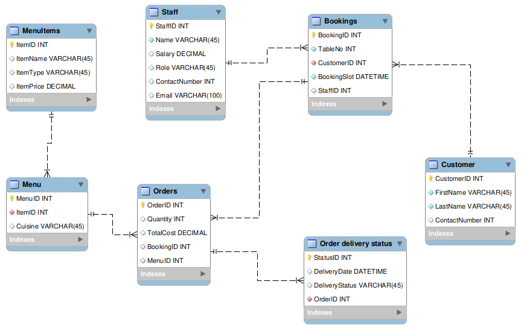

# Database Engineering Capstone Project

> Step 1 involves setting up a MySQL instance server in MySQL Workbench, then creating an ER Diagram data model and implementing it in MySQL.

### LittleLemon Database Model

### LittleLemon Database Schema
<a href="LittleLemonDB.sql" target="_blank">LittleLemon Database Schema Link</a>
