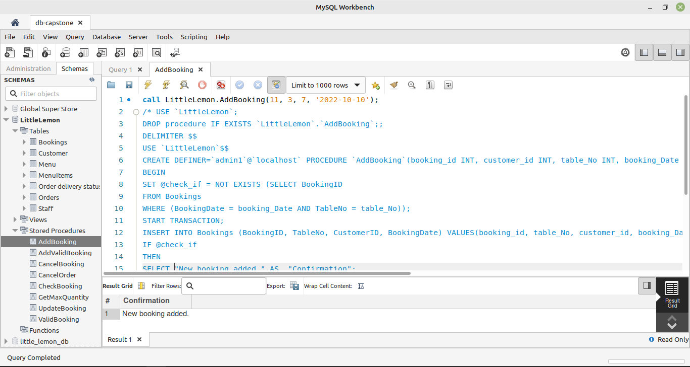
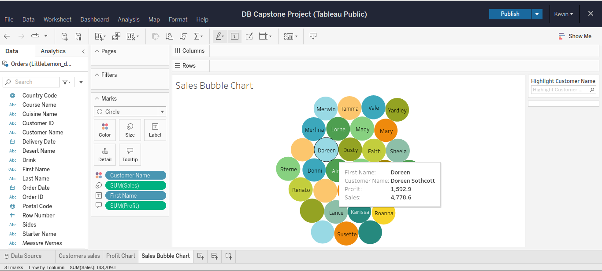

# Database Engineering Capstone Project

> Step 1 involves setting up a MySQL instance server in MySQL Workbench, then creating an ER Diagram data model and implementing it in MySQL.

### LittleLemon Database Model

### LittleLemon Database Schema
<a href="LittleLemonDB.sql" target="_blank">LittleLemon Database Schema Link</a>

### Adding Sales Reports

> Create a virtual table called OrdersView that focuses on OrderID, Quantity and TotalCost columns within the Orders table for all orders with a quantity greater than 2.

> Extract the required information from the Customer, Orders, Menu and MenuItems table by using the relevant join clausen on all customers with orders that cost more than $150. The result set should be sorted by the lowest cost amount.

> Find all Menu items for which more than 2 orders have been placed. Create a subquery that checks if any item quantity in the orders table is more than 2. The outer query should be used to select hte menu name from the menu table

> Create a stored procedure that displays the maximum ordered quantity in the orders tables.

> Create a prepared statement called GetOrderDetail which should accept one input argument, the CustomerID value, 
   from a variable. The statement should return the order id, the quantity and the order cost from the Orders table.
   

> Create a stored procedure called CncelOrder to be used to delete an order record based on the user input
   of the order id.
   

### Table Booking System

> Bookings Table

> Create a stored procedure called CheckBooking to check whether a table in the restaurant is already booked.
  The procedure should have two input parameters in the form of booking date and table number.
  
 

> Create a new procedure called AddValidBooking. This procedure must use a transaction statement to perform a rollback if a customer reserves a table that’s already booked under another name.

> Create a new procedure called AddBooking to add a new table booking record.The procedure should include four input parameters in the form of the following bookings parameters: booking id, customer id, booking date, and table number.

> Create a new procedure called UpdateBooking that they can use to update existing bookings in the booking table.
The procedure should have two input parameters in the form of booking id and booking date. You must also include an UPDATE statement inside the procedure. 

> Create a new procedure called CancelBooking that they can use to cancel or remove a booking. The procedure should have one input parameter in the form of booking id. You must also write a DELETE statement inside the procedure. 

### Set up the Tableau Workspace for data analysis

> Create two new data fields called First Name and Last Name. Related values should be extracted from the Full Name field.create two new data fields called First Name and Last Name. Related values should be extracted from the Full Name field.

> Create a new data field that stores the profits for each sale, or order.

### Create interactive dashboard for sales and profits

> Create a bar chart that shows customers sales and filter data based on sales with at least $70.

> Create a line chart to show the sales trend from 2019 to 2022.

> Create a Bubble chart of sales for all customers. The chart should show the names of all customers. Once you roll over a bubble, the chart should show the name, profit and sale.

> Compare the sales of the three different cuisines sold at Little Lemon. Create a Bar chart that shows the sales of the Turkish, Italian and Greek cuisines.
Display sales data for 2020, 2021, and 2022 only. Each bar should display the profit of each cuisine. 

 

> Create an interactive dashboard that combines the Bar chart called Customers sales and the Sales Bubble Chart. Once you click a bar, and roll over the related bubble, the name, sales and profit figures should be displayed in the Bubble chart.

### LittleLemon Database Client

